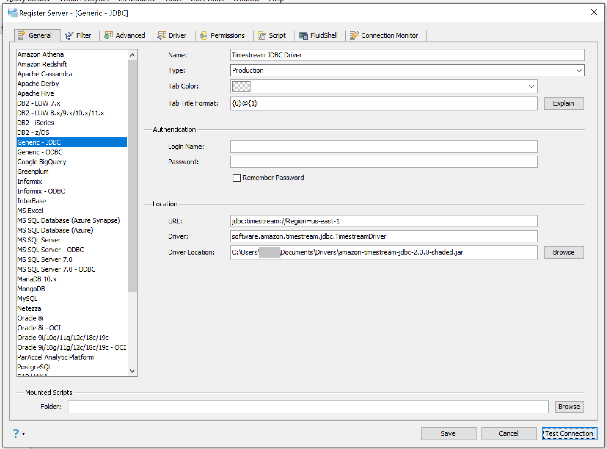
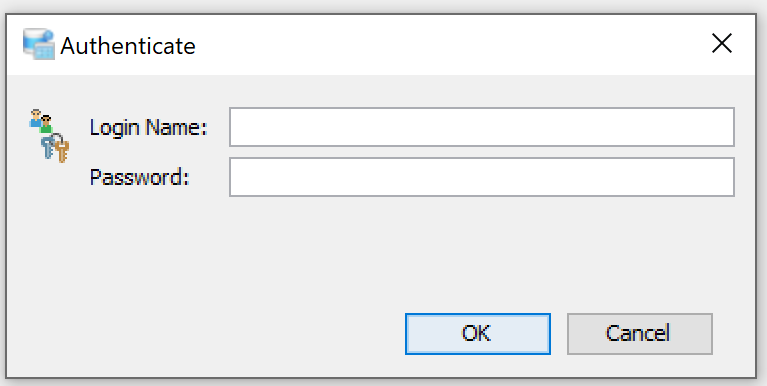
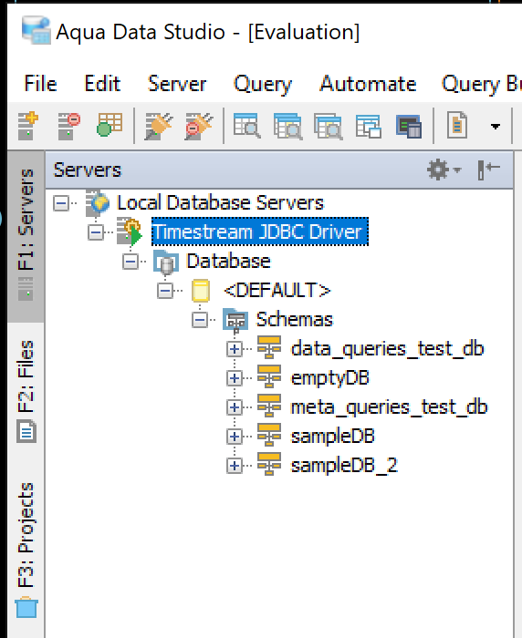
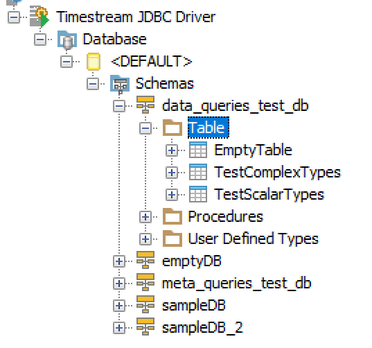

### Aqua Data Studio
[Link to product webpage](https://www.aquafold.com/aquadatastudio/).

#### Using Aqua Studio with Generic JDBC driver

1. Access **Server Properties** by using the Keyboard combination "CTRL + SHIFT + P", or follow the steps below. 
    1. Locate the Server in the Server Browser

    2. Right-click on the Server - A Popup Menu Appears

    3. Click on the Item which displays **Server Properties**.

    

2. In the **General** tab, select **Generic - JDBC** and fill in the properties:

    1. In **Name**, enter driver name, e.g., `Timestream JDBC Driver`.

    2. In **URL**, enter the connection string `jdbc:timestream://PropertyName1=value1;PropertyName2=value2...`. For a list of connection properties (e.g., Access Key, Secret Key, Region, etc.), see [README](../../README.md#optional-connection-properties).

    3. In **Driver**, enter `software.amazon.timestream.jdbc.TimestreamDriver`. 

    4. In **Driver Location**, click the “Browse” on the right side to select the Timestream JDBC JAR file.

    5. Click on **Test Connection** (button on the lower right) to ensure a connection can be established.

    6. Click **Save** (button on the lower left) to save the configuration.

#### Connecting to the database

1. After the Amazon Timestream JDBC driver is set up, you should see “Timestream JDBC Driver“ under “Local Database Servers“ like below image

2. Double click on “Timestream JDBC Driver“ to connect to the database. A pop-up window will occur and ask for authentication. Press **OK** without entering any field since Timestream authentication can be set through AWS CLI configuration or passed through the connection string (as entered in the URL field).

3. Click on the “+” beside **Database** to expand, and click “+“ to expand on **\<DEFAULT\>**, then click on “+” beside **Schemas** to see the list of databases.

4. To access the list of tables under desired database, click on the “+” beside that database and then click on “+” beside **Table**.

