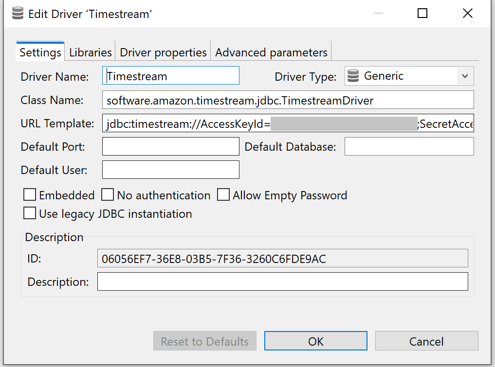
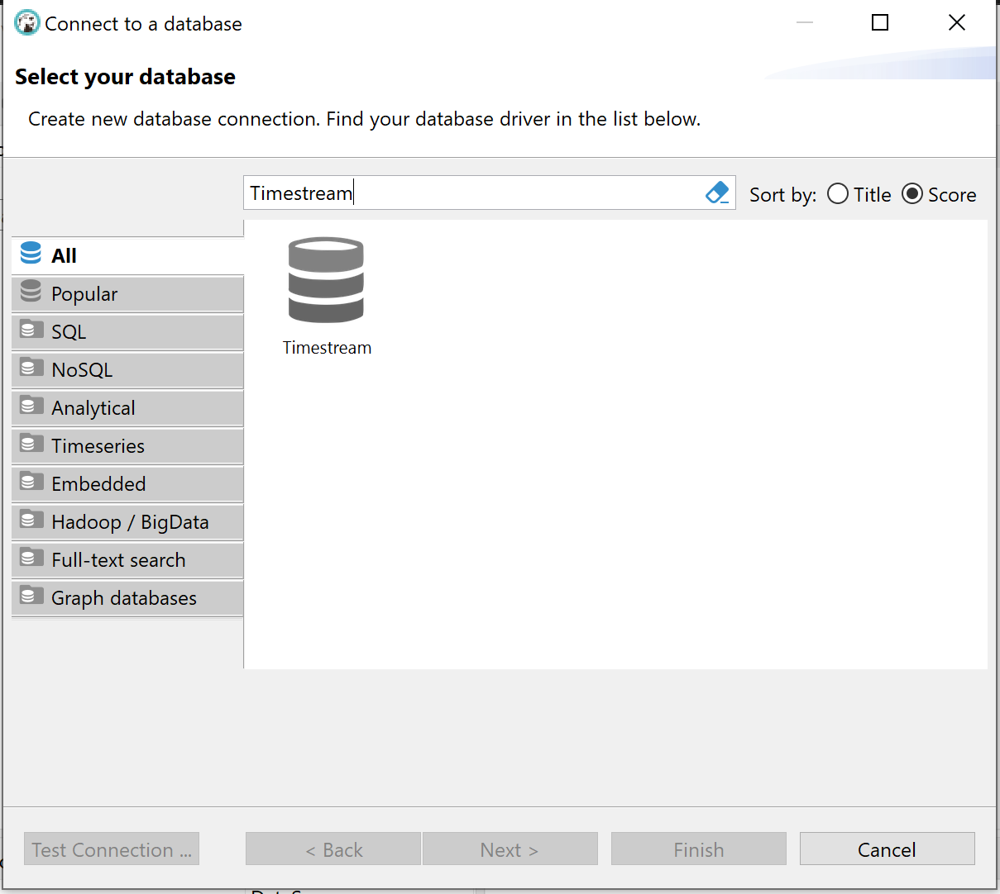
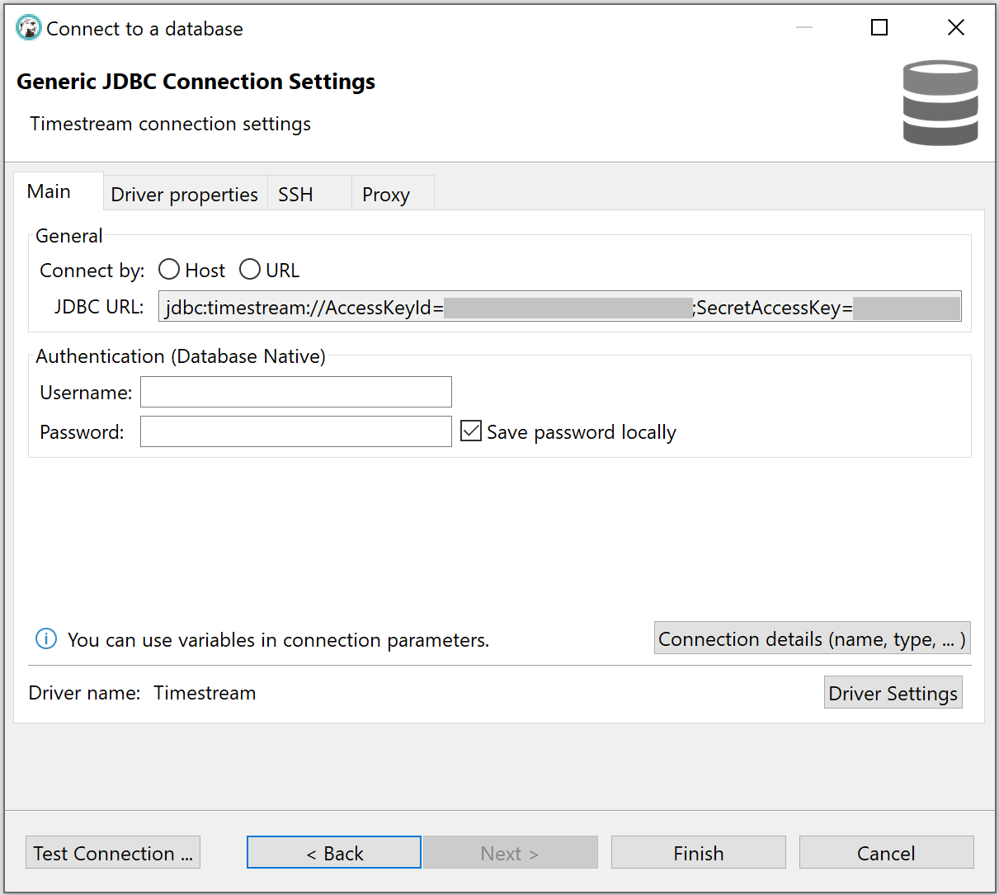
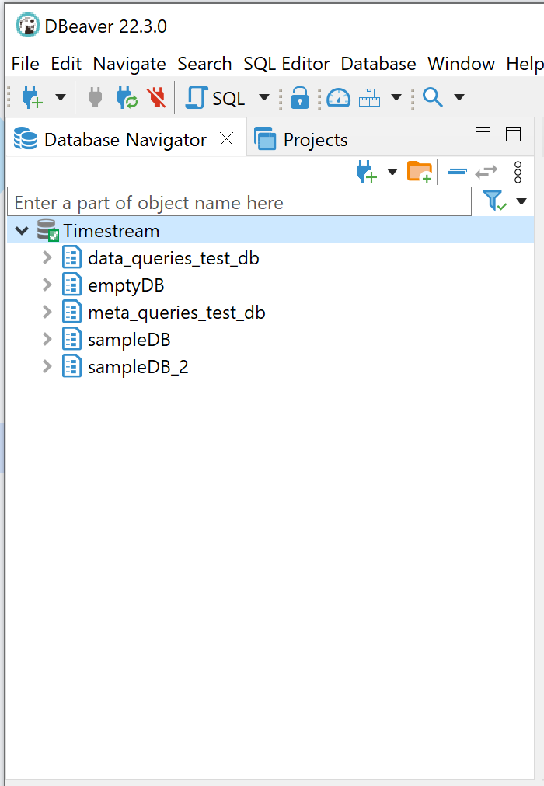

### DBeaver 
[Link to product webpage](https://dbeaver.io/download/).

#### Adding the Amazon Timestream JDBC Driver
1. [Download](https://github.com/awslabs/amazon-timestream-driver-jdbc/releases/latest) the Timestream JDBC driver shaded JAR file (e.g., `amazon-timestream-jdbc-2.0.0-shaded.jar`)

2. Launch the DBeaver application.

3. In the main menu, navigate to and select **Database > Driver Manager > New**.

    a. In **Settings** tab, for **Driver Name** field, enter a descriptive name (e.g. `Timestream`)

    b. In **Settings** tab, for **URL Template** field, enter your JDBC connection string. For example:
      
        ```
        -- replace the values in "<>" with your own value
        jdbc:timestream://Region=<region>;
        ```

    If your database requires an username and password, it can be entered in the connection string when setting up the driver

        ```
        -- replace the values in "<>" with your own value
        jdbc:timestream://AccessKeyId=<myAccessKeyId>;SecretAccessKey=<mySecretAccessKey>;SessionToken=<mySessionToken>;Region=<myRegion>
        ```

    or username and password can be entered later when connecting to Amazon Timestream using DBeaver.

    

    c. In **Libraries** tab, click Add file and navigate and select your Amazon Timestream JDBC driver JAR file.

    d. In **Libraries** tab, after adding the JAR file, click **Find Class**. There maybe nothing listed in the **Driver class:**. If that is the case, ignore it and continue the next step. 

    

    e. In **Settings** tab, the field Class Name should be automatically filled in. If not, enter the **Class Name:** ```software.amazon.timestream.jdbc.TimestreamDriver```. Click **Ok**.

#### Connecting to Amazon Timestream Using DBeaver
1. In the main menu, navigate to and select **Database > New Database Connection**.
    
2. Select your database/driver created above identified by Driver Name you chose. 

    

3. In the **Main** tab, in the **Authentication** section, enter the username and password if your database requires it AND if it was not entered in URL Template when setting up your driver. Otherwise you can leave it empty. The **JDBC URL** for your driver is shown in this prompt.

    

4. Click **Test Connection ...** to confirm your connection and then click **Finish**. After you succeed to connect to Timestream, click the driver name on the left window. Then you will be able to see the all the database listed as the example.

    