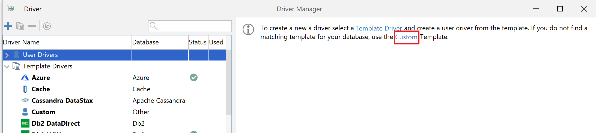
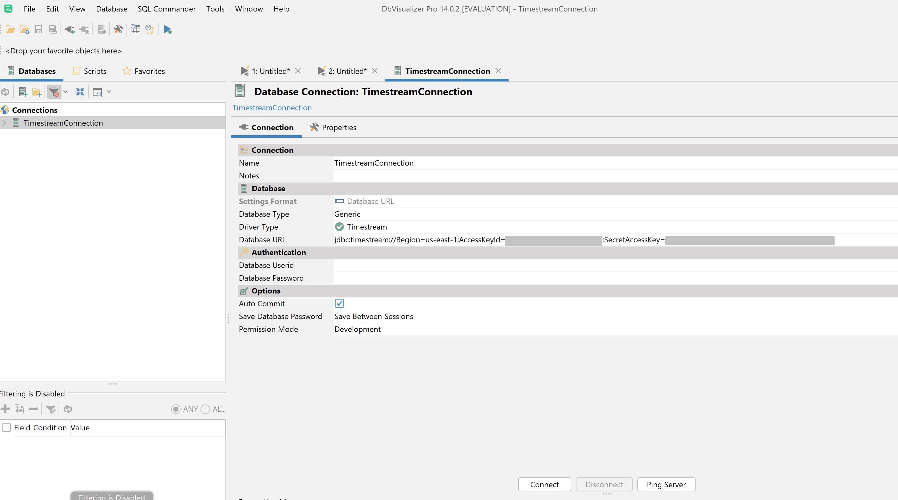

### DbVisualizer 
[Link to product webpage](https://www.dbvis.com/download/).

#### Adding the Amazon Timestream JDBC Driver
1. [Download](https://github.com/awslabs/amazon-timestream-driver-jdbc/releases/latest) the Timestream JDBC driver shaded JAR file (e.g., `amazon-timestream-jdbc-2.0.0-shaded.jar`)
2. Start the DbVisualizer application and navigate to the menu path: **Tools > Driver Manager...**. In the popped up window, click the "Custom" link on the right side.

    

3. In the new popped up window, find **Driver Settings** tab and fill the following info.

    a. For the **Name:** field, enter **Timestream**

    b. For the **URL Format:** field, enter ```jdbc:timestream://PropertyName1=value1;PropertyName2=value2...```

    c. Click the **+** on the right side to select the Timestream JDBC JAR file.

    d. Ensure the ```software.amazon.timestream.jdbc.TimestreamDriver``` is selected in the **Driver Class:** field. Your Driver Manager settings for **Timestream** should look like the following image.

    

    e. Close the dialog. Now the Timestream JDBC driver is added and ready to use.

4. Connecting to Amazon Timestream Using DbVisualizer

    a. Navigate the menu path **Database > Create Database Connection**

    b. For the **Name** field, enter a descriptive name for the connection, for example ```TimestreamConnection```

    c. For the **Driver Type** field, ensure the **Timesteam** is selected.

    d. For the **Database URL** field, enter your JDBC connection string. For example, ```jdbc:timestream://region=us-east-1;```

    e. For the **Database Userid** field, enter your Amazon Timestream user ID.

    f. For the **Database Password** field, enter the corresponding password for the user ID.

    g. Your **Database Connection** dialog should look like the following.

    

    h. Then click **Connect** button to connect to Timestream.