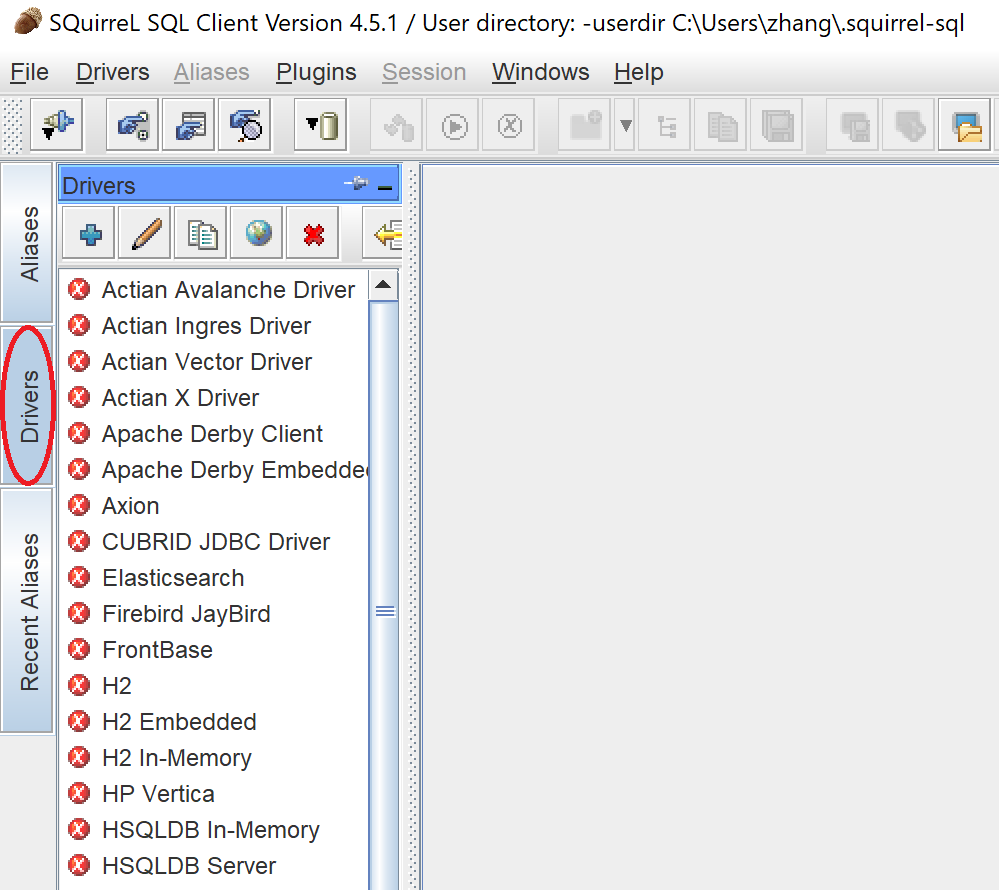
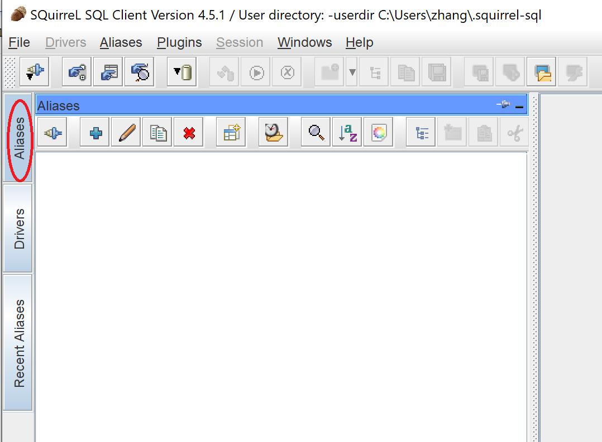
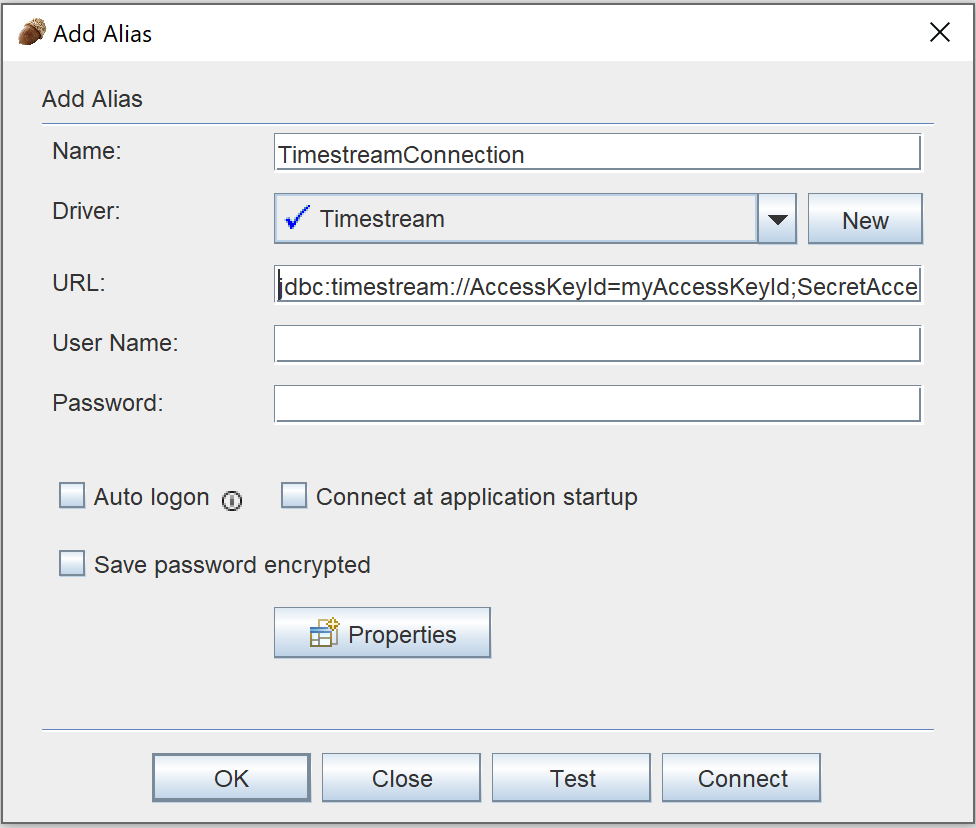
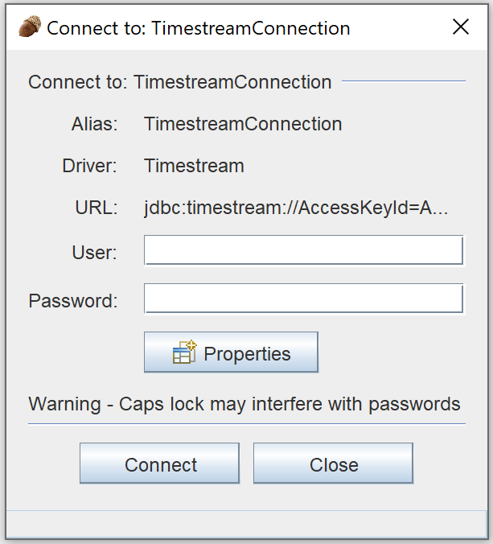

### SQuirreL SQL Client 
[Link to product webpage](https://sourceforge.net/projects/squirrel-sql/).

#### Adding the Amazon Timestream JDBC Driver

1. Launch the SQuirreL SQL Client application.
2. Ensure the **Drivers** tab is selected.

    

3. Navigate to menu path **Drivers > New Driver ...**

    

4. For the **Name:** field, enter **Timestream**.
5. For the **Example JDBC URL:** field, enter `jdbc:timestream://Region=<region>;`
6. Select the **JDBC Driver Class Path** tab.
7. Click the **Add** button and navigate to the downloaded Amazon Timestream JDBC driver JAR file.
8. Click **OK** to add the JAR file to the **JDBC Driver Class Path**.
9. Click the **List Drivers** button.
10. For the **Class Name:** field, ensure the `software.amazon.timestream.jdbc.TimestreamDriver` is selected.

    

11. Click the **OK** button to create and save the driver settings.

#### Connecting to Amazon Timestream Using SQuirreL SQL Client

1. Launch the SQuirreL SQL Client application.
2. Ensure the **Aliases** tab is selected.

    

3. Navigate the menu path **Aliases > New Alias...**
4. In the popped up window, fill the following info

    a. For the **Name:** field, enter a name for this alias. For example, `TimestreamConnection`
    
    b. For the **Driver:** field, ensure **Timestream** is selected.

    c. For the **URL:** field, enter your JDBC connection string. For example, `jdbc:timestream://Region=us-east-1;`

    

    d. For the User **User Name:** field, enter your Amazon Timestream account ID.
    
    e. For the **Password:** field, enter the corresponding password for the acount ID.

5. Click **OK** to save the alias.
6. Double-click your alias to start the connection dialog.
7. Click the **Connect** button to connect.

    

8. After you succeed to connect to Timestream, you will be able to see a window as the example.

    