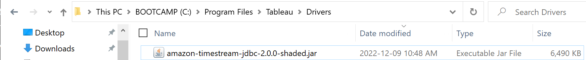
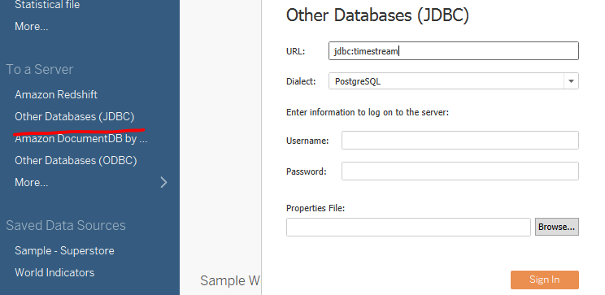

### Tableau Desktop
[Link to product webpage](https://www.tableau.com/products/desktop).

#### Using Tableau with Generic JDBC driver (without using Connector).
1. [Download](https://github.com/awslabs/amazon-timestream-driver-jdbc/releases/latest) the Timestream JDBC driver fully shaded JAR file (e.g., `amazon-timestream-jdbc-2.0.0-shaded.jar`) and copy it to one of these
   directories according to your operating system:
   - **_Windows_**: `C:\Program Files\Tableau\Drivers`
   
    - **_macOS_**: `~/Library/Tableau/Drivers`

2. Open Tableau > Connect > Other Databases (JDBC)

3. Enter URL: `jdbc:timestream` and select dialect as `PostgreSQL`. Click `Sign In` after adding any optional [connection properties](../../README.md#optional-connection-properties).

