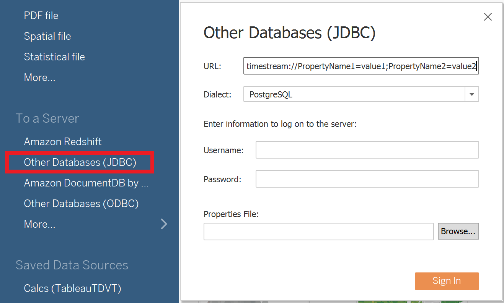

### Tableau Desktop
[Link to product webpage](https://www.tableau.com/products/desktop).

#### Adding the Amazon Timestream JDBC Driver
1. [Download](https://github.com/awslabs/amazon-timestream-driver-jdbc/releases/latest) the Timestream JDBC driver shaded JAR file (e.g., `amazon-timestream-jdbc-2.0.0-shaded.jar`) and copy it to one of these
   directories according to your operating system:
   - **_Windows_**: `C:\Program Files\Tableau\Drivers`
   
    - **_macOS_**: `~/Library/Tableau/Drivers`

2. Using a text editor, copy and paste the entire <connection-customization> section of data source file. 
```
<?xml version='1.0' encoding='utf-16' ?>
<connection-customization class='genericjdbc' enabled='true' version='2020.6'>
<vendor name='genericjdbc' />
<driver name='timestream' />
<customizations>
     <customization name='CAP_JDBC_METADATA_SUPPRESS_PREPARED_QUERY	' value='yes'/>
     <customization name='CAP_CREATE_TEMP_TABLES' value='no'/>
</customizations>
</connection-customization>
```

3. Name the file `jdbc-timestream.tdc` and save it to the following location according to your operating system:
   - **_Windows_**: `C:\Users\<username>\Documents\My Tableau Repository\Datasources`
   - **_macOS_**: `/Users/<username>/Documents/My Tableau Repository/Datasources/`

4. Open Tableau > Connect > Other Databases (JDBC)

5. Enter URL: `jdbc:timestream` and select dialect as `postgreSQL`. Click `sign in` after adding [connection properties](../../README.md#optional-connection-properties).

